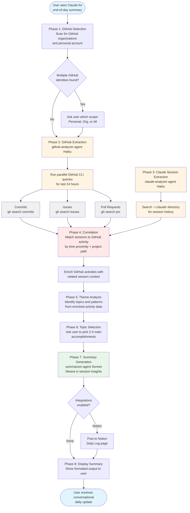

# Shipmate

[](https://github.com/dreamiurg/shipmate/releases/latest)
[](https://github.com/semantic-release/semantic-release)
[](https://docs.claude.com/claude-code)
[](https://opensource.org/licenses/MIT)

> Your daily dev sidekick for tracking what you ship

Shipmate is a [Claude Code](https://docs.claude.com/claude-code) plugin that generates conversational end-of-day summaries from your GitHub activity. Perfect for team standups, personal logs, or just remembering what you accomplished today.

```markdown

 ▐▛███▜▌   Claude Code v2.0.34
▝▜█████▛▘  Sonnet 4.5 · Claude Max
  ▘▘ ▝▝    /tmp

> Generate my end-of-day summary

⏺ I'm using the shipmate:eod skill to generate an end-of-day summary.
⏺ I'll generate your end-of-day summary. Let me start by creating a task list to track our
  progress.
⏺ Now let me detect your GitHub organizations and username.

...

⏺ User answered Claude's questions:
  ⎿  · Which GitHub activity would you like to include in your end-of-day summary? → Personal
     account only (dreamiurg)

⏺ shipmate:github-analyzer-agent(Extract GitHub activity data)
  ⎿  Done (7 tool uses · 26.6k tokens · 1m 42s)

⏺ User answered Claude's questions:
  ⎿  · Which topics should be highlighted as main accomplishments? (Select 2-4. Everything else
     will be grouped as 'Housekeeping') → Fixed Shipmate plugin naming and registration issues,
     Wrote blog post about Shipmate development

⏺ shipmate:summarizer-agent(Generate conversational summary)
  ⎿  Done (0 tool uses · 6.4k tokens · 13.5s)

⏺ Here's your end-of-day summary:
Daily Update - November 5, 2025

- **Fixed Shipmate plugin naming and registration issues** - Spent some time debugging why the Shipmate
plugin kept triple-invoking itself. Turns out Claude Desktop’s plugin system auto-prefixes skill
names with the plugin name, so having both a slash command AND a skill with overlapping names was
causing conflicts. The skill was being called three different ways at once. Fixed it by removing the
slash command entirely and renaming the skill directory to match the expected registration name. Also
had to chase down a bunch of related issues - duplicate namespace prefixes, incorrect script paths
after the directory rename, and the version footer not updating properly. Got it all working and
released version 1.1.8 (https://github.com/dreamiurg/shipmate/releases/tag/v1.1.8)

- **Wrote blog post about Shipmate development** - Documented the journey of building the Shipmate
end-of-day summary skill, from initial idea through the naming issues I ran into today. Focused on
the process and what I learned about Claude Desktop’s plugin system - how it handles skill
registration, the auto-prefixing behavior, and why slash commands can collide with skill names. Also
added a style guide to my blog that emphasizes intellectual honesty and process-focused narrative,
inspired by writing principles of the blog authors I follow.

- **Housekeeping** - Set up pre-commit hooks for several repos (gitleaks for secrets, markdownlint for
documentation quality, conventional commits for PR titles), added CI workflow to Shipmate with
badges for build status and latest release, configured branch protection, updated documentation to
reference the main branch instead of master, and cleaned up some stale tool version files.
```

## How It Works

The shipmate:eod skill follows a multi-phase workflow to generate conversational end-of-day summaries:



**Key Features:**

- **Two-Tier Agent Architecture**: Fast Haiku agents for data extraction, powerful Sonnet agent for narrative synthesis
- **Parallel Extraction**: GitHub CLI queries run simultaneously; Claude sessions extracted independently
- **Smart Correlation**: Matches Claude Code sessions to GitHub activities by time proximity (±2 hours) and project path
- **Session Insights**: Reveals depth of work behind commits (duration, message count, file edits, bash commands)
- **User Control**: You select which topics become main accomplishments vs housekeeping
- **Graceful Degradation**: Continues with available data if sources fail; handles missing Claude session directory
- **Multi-Integration Support**: Post summaries to Notion, with Slack and other integrations planned

## Installation

### Prerequisites

- [Claude Code](https://docs.claude.com/claude-code) installed
- [GitHub CLI (`gh`)](https://cli.github.com/) version 2.23.0 or higher
- GitHub CLI authenticated (`gh auth login`)

### Install Plugin

This repo contains both marketplace and plugin. To add it to Claude Code, run:

```bash
% claude
> /plugin marketplace add dreamiurg/shipmate
  ⎿  Successfully added marketplace: shipmate-marketplace

> /plugin install shipmate@shipmate-marketplace
  ⎿  ✓ Installed shipmate. Restart Claude Code to load new plugins.
```

### Verify Installation

In any Claude Code session:

```bash
"What skills are available?"
```

You should see `shipmate:eod` listed.

## Usage

Ask Claude to generate your end-of-day summary:

```text
"Generate my end-of-day summary"
```

Or directly invoke the skill using the Skill tool:

```text
Use the shipmate:eod skill
```

The skill will:

1. Ask which GitHub scope to include (personal, org, or all)
2. Extract your activity from the last 24 hours
3. Identify themes and topics from your work
4. Ask you to select 2-4 main accomplishments
5. Generate a conversational summary
6. Optionally post to Notion (if configured)

## Features

- **Smart activity extraction** - Pulls commits, issues, and PRs from the last 24 hours
- **Claude Code Session Integration** - Reveals depth of work behind commits by correlating with Claude Code session history
- **Conversational summaries** - Turns raw GitHub data into readable updates
- **Multi-organization support** - Track activity across personal and org accounts
- **Topic selection** - You pick what to highlight vs what's housekeeping
- **Pluggable integrations** - Post to Notion, Slack (coming soon), or save locally

## Configuration

Shipmate can be configured via `shipmate.yaml` in either:

- `~/.claude/shipmate.yaml` (global config)
- `<project>/.claude/shipmate.yaml` (project-specific, overrides global)

See [`config.example.yaml`](config.example.yaml) for all options.

### Example Configuration

```yaml
# Set default GitHub scope
github_scope: "all"  # or "personal" or "my-org-name"

# Claude Code Session Integration
claude_sessions:
  enabled: true                    # Enable Claude Code session integration
  time_window_hours: 24            # How far back to look for sessions
  correlation_window_hours: 2      # Time proximity for matching sessions to commits
  min_duration_minutes: 2          # Ignore sessions shorter than this

# Enable integrations
integrations:
  notion:
    enabled: true
    daily_log_url: "https://www.notion.so/your-workspace/Daily-Log-abc123"
```

See [Claude Sessions Documentation](docs/CLAUDE_SESSIONS.md) for details.

## Integrations

### Notion

Post your daily summary to a Notion Daily Log page. See [integrations/notion/README.md](integrations/notion/README.md) for setup instructions.

## Example Output

```markdown
# Daily Update - November 4, 2025

**What I accomplished today:**

- **Investigated AWS infrastructure** - Dug through the AWS account to see what we're working with. Found the IAM setup, about 3.37 GB of data sitting in S3 buckets, VPC config, and figured out who has admin access. Got it all documented for when we migrate to a new AWS Organization (https://github.com/example-org/docs/blob/main/infrastructure/aws.md)

- **Investigated deployment process** - Figured out how we actually ship code. Frontend is manual deploys through Vercel CLI, backend auto-deploys from GitHub via Railway. Takes 2-5 minutes. (https://github.com/example-org/docs/blob/main/infrastructure/deployment-process.md)

- **Housekeeping** - Set up pre-commit hooks to prevent secrets from leaking, added markdown linting, created issue templates
```

## Customization

### Change Summary Format

Edit `agents/summarizer-agent.md` to customize:

- Tone and style
- Output structure
- What details to include/exclude

### Change Data Sources

Edit `agents/github-analyzer-agent.md` to:

- Add more GitHub queries
- Include different time ranges
- Filter by labels or other criteria

### Add New Integrations

1. Create `integrations/<name>/README.md` with setup instructions
2. Add integration config to `config.example.yaml`
3. Update `skills/shipmate:end-of-day-summary/SKILL.md` Step 8 to handle the new integration

## Contributing

See [CONTRIBUTING.md](CONTRIBUTING.md) for local development setup, testing, and contribution guidelines.

## License

MIT License - see [LICENSE](LICENSE) for details
